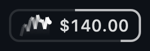
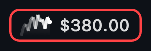
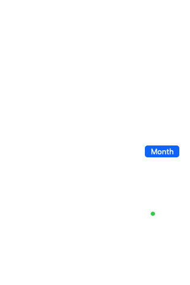

<div align="center">

# Vela Ishtar

**Your AI Hub spend, in the corner of your eye — never in your face.**

A macOS menu bar app that shows your personal AI Hub (LLM gateway) usage at a
glance. An instrument, not a scoreboard.

-000000?style=flat-square&logo=apple&logoColor=white)


[](CHANGELOG.md)


</div>

## The menu bar

One pill. Three instruments.



- **The pulse** — a live sparkline of your last hour of burn, age-faded so the
  newest samples read brightest
- **The amount** — today's spend in dollars
- **The border IS the budget** — the pill's own outline traces your daily
  budget as it fills, and it's the one element allowed to raise its voice. It
  escalates in one direction only, as the day goes:

| Border | The pill | Meaning |
|---|---|---|
| quiet ink |  | under half your budget |
| **yellow past 50%** |  | a heads-up; nothing to act on yet |
| **amber past 75%** |  | the warning, while you can still change course |
| **closed red loop past 90%** |  | the alarm, while there's still budget to protect |

The *number* only dims once you've actually spent 100%. The border warns early;
the app never claims your budget is gone while a tenth of it remains.


Everything dims when the gateway is unreachable — your data is never silently
stale.

**Pill size ladder.** Full (88pt, above) → Compact (52pt, drops the sparkline
and rounds the amount) → Minimal (26pt, the border gauge alone). Pick one from
the right-click menu under *Pill size*, or leave it on Automatic and it falls to
Minimal when a notch clips the status item. Right-click also offers *Copy
today's spend*, *Open history folder*, and *Quit*.

## The popover

Click the pill. One panel, hairlines and whitespace only. It answers four
questions in the order you'd ask them — how much today, at what pace, on which
models, and how does this week compare — and each answer holds a fixed slot, so
the card never resizes under your pointer.



**How much today?** `$54.51 of $400 today`, in large monospaced digits.

**At what pace?** One computed sentence — *"At this pace you'll reach budget
around 9:40 pm."* When there's nothing urgent to say, it compares you against
yourself instead: *"Typical day by now: $34 — you're at $12."* On the Month tab
it adds a runway line, *"On track for ~$X this month."*

**Today's curve.** Cumulative spend hour by hour against a dotted budget
ceiling, with the median of your recent days drawn faintly behind it — no
legend, no label; the shape is the sentence. **Hover it** for a crosshair and a
dot that snaps to the nearest hour you actually have a reading for, plus a
floating readout in your local time. A gap hour never answers: the pointer past
your last reading snaps back to it rather than inventing a value.

**Which models?** Ranked by cost, with a Today / Month switcher. Each row shows
the model, its share of the period's spend (`gpt-5 · 62%`), the cost, and the
unit price in `$/M tokens` — because two models can burn identical tokens at
wildly different prices, so raw token counts are a vanity metric.

**How does this week compare?** Seven cells above the footer, a true
Monday-to-Sunday calendar week — the letters are always `M T W T F S S`, so the
row is a frame you learn rather than one that re-labels itself each morning. Each
cell is shaded by that day's share of the week's biggest, the contribution-graph
grammar, so the week's shape reads at a glance. Today wears a ring and advances
through the fixed row as the week goes; the days still ahead sit empty, and a day
that hasn't happened never joins the week's max. **Hover any cell** for that
day's exact cost. A day with no reading stays silent rather than claiming
`$0.00` — that would be a different claim. The strip appears once at least 4
days of the current week carry data.

### The chrome, top-right

Two 20pt slots in the corner, outside the layout flow. Both are chrome, not
data: neither dims when a reading goes stale.

**The update bell.** A permanent status light, so "no news" is something you can
actually read off the popover rather than infer from an absence. Grey and
perfectly still when you're up to date — clicking it shows a quiet one-line card
naming the version you're running, and offers nothing else, because there's
nothing to do. Yellow and gently rocking when a newer GitHub release exists;
clicking then gives you the one-line Homebrew update command with a **Copy**
button, a link to the release notes, and **Skip this version**, which is
remembered per version (skipping 1.0.1 won't hide 1.0.2). It checks at most once
every six hours, stays quiet when offline, and never downloads or installs
anything by itself.

**The version dot.** A 6pt dot in the far corner. Hover it for the changelog
card: the running version's own note first, then the recent history beneath it.
The list is generated from `CHANGELOG.md` at build time, so it can't drift from
the binary you're running.

**The footer.** `Dashboard ↗` · `API key` · `Start at login` · a health dot
that goes amber and dims everything when the gateway is unreachable.

**Opening cold.** If today's local history holds a reading, the popover shows it
immediately — dimmed, captioned *"Last reading · 4m ago"* — and the live poll
brightens it in place. A brightness change, not a numbers jump. A true first run
shows an honest spinner.

## Install

**Homebrew (recommended):**

```bash
brew tap NSXBet/tap
brew install --cask vela-ishtar
xattr -cr "/Applications/Vela Ishtar.app"
open -a "Vela Ishtar"
```

The tap is private to the NSXBet org — you need GitHub access to it. The
`xattr -cr` clears the quarantine flag (the app is ad-hoc signed; we don't
have an Apple Developer account yet).

**Update to a new version:**

```bash
brew update && brew upgrade --cask vela-ishtar
xattr -cr "/Applications/Vela Ishtar.app"
```

That's the same one-liner the update bell hands you.

**Direct download:**

```bash
curl -LO https://github.com/NSXBet/vela-ishtar/releases/download/v1.0.4/VelaIshtar-1.0.4.zip
unzip VelaIshtar-1.0.4.zip -d /Applications/
xattr -cr "/Applications/Vela Ishtar.app"
open -a "Vela Ishtar"
```

**After launching:** there is no window — Vela Ishtar is a menu bar app.
Look top-right, next to the clock: a small pill showing today's spend.
Click it for the full popover. If you don't see the pill, your menu bar
may be full (common on notched MacBooks) — quit a few other menu bar
apps and relaunch.

**From source** (no Xcode needed, Command Line Tools only):

```bash
git clone https://github.com/NSXBet/vela-ishtar.git
cd vela-ishtar
./build.sh
open "build/Vela Ishtar.app"
```

On first launch the popover asks for your AI Hub token (the same `gt_…`
token you use for the gateway). It's stored in your macOS Keychain and
never leaves your Mac except to the AI Hub gateway. macOS asks once to
authorize the Keychain item — that's normal.

Optional: toggle **Start at login** in the popover footer.

## How it works

- Polls `GET https://ai-llm-gateway.fbr.land/v1/me/usage` every 60s with
  your token. The response is scoped to you only.
- Your daily budget resets at **midnight UTC** — that's how the gateway
  buckets spend, so that's the boundary the pace sentence uses.
- Your personal limit comes from the API, so the UI auto-scales whether
  your budget is $100, $400, or anything else.
- Hourly spend history is cached locally in
  `~/Library/Application Support/VelaIshtar/history.json` — it powers
  the curve, the week strip, and the median comparisons, and gets richer
  the longer you run the app.

**Days are the gateway's, not your clock's.** History is keyed by the API's
`spend_date` label, because the two disagree around midnight — keying by local
UTC used to file yesterday's total under today and make the curve visibly
decrease within a day.

**Models period switcher.** Month ranks models by current-month cost, straight
from the API. Today comes from the gateway's `today_models` breakdown when
the payload carries it, reconciled against your authoritative daily total
(any sub-cent residue lands in an explicit `Other` row, and a breakdown that
contradicts the day total is rejected outright). If the gateway doesn't
provide today-scoped model data, the app says "Per-model breakdown is monthly
only" instead of inventing a split. A Week segment was removed:
`/v1/me/usage` has no weekly per-model endpoint.

**Comparison surfaces wait for enough data.** The ghost curve and the median-day
sentence need five past days holding a reading at the hour being compared; the
week strip needs at least 4 days of the current week to carry data. Below that
they stay hidden, and all three also stay hidden while a reading is stale —
pinning "a typical day" against hours-old data would be a confident lie. Silence
beats a number computed from thin data; that's the same rule everywhere in the
app.

**History explorer.** Right-click the pill → *History explorer* (or the
export row in Settings) to open a native window over your locally stored
readings: pick a scope and a day, see every retained observation with honest
coverage — a partial day says PARTIAL, an empty day never claims $0.00. From
there you can export a day (or a scope) as clean RFC-4180 CSV — invariant dot
decimals, no formulas, no tokens — and clear a credential's history entirely.

**Spend markers.** Inside the explorer, start a marker at an observation and
finish it at a later one; the app measures the observed spend inside the
interval and lists it by name. Deltas that can't be measured honestly — a
token switch mid-interval, a downward correction, a midnight crossing — say
so explicitly instead of showing a guessed number. Markers persist across
relaunches, and the last 100 receipts are kept.

**Budget detail.** If your gateway enforces nested per-model caps, the budget
sheet shows every returned cap with its room, flags which one is binding
right now, and states plainly that the returned caps are not a model-
availability catalog. Cooldowns ("relaxed until …") are shown and expire
correctly.

**Retention and footprint.** History keeps the newest 90 gateway days and
coarsens the oldest observations first if the store would exceed its 2 MiB
budget; first, last, and policy-boundary readings are always kept. Markers
cap at 100 receipts. Everything lives in
`~/Library/Application Support/VelaIshtar/`.

**Rebuilding from source:** each `./build.sh` changes the ad-hoc signature,
so macOS may ask once for Keychain access on the first run of a new build.
One prompt per rebuild; one-time for a build you keep. Apple Silicon only
(arm64) for now.

## Design principles

Calm assurance. Facts, plainly stated, then silence. No leaderboards, no
notifications, no "AI insights", no celebration mechanics. Monochrome
everywhere except the budget border, which is the one thing allowed to raise
its voice — and only in one direction, as spend climbs.

Two rules earn most of the behaviour above:

- **Never show a number the data doesn't support.** Gaps stay gaps, derived
  splits that don't reconcile aren't shown, stale readings are dimmed and
  bannered, and every comparison surface waits for enough history.
- **The fewer pixels that move, the more each one means.** The card is a fixed
  height in both periods, so a tab tap moves nothing but the indicator. Motion
  is reserved for four things — the curve's draw-on, the sonar ring that
  announces the scrubber, the period indicator's slide, and the update bell's
  rock — and every one of them is off under Reduce Motion.

## Tech

Pure AppKit, zero dependencies, ~14,600 LOC (comments included — this
codebase explains itself). All targets pin the Swift 5 language mode, so
Swift 6-defaulting toolchains stay usable. Builds with bare `swiftc` into an
ad-hoc-signed `.app` — no Xcode. SwiftPM runs the unit tests.

```bash
make test     # 585 unit tests in 53 suites
./build.sh    # compile + bundle + ad-hoc sign into build/Vela Ishtar.app
make release  # sync README, rebuild, zip for the Homebrew cask
```

The split is deliberate. `Sources/VelaCore` is pure Foundation and holds every
rule worth pinning — pace verdicts, freshness (a 90-second age window), the
Observation history engine (validated ingestion, quarantine, 90-day retention,
a 2 MiB envelope budget), spend markers, CSV export, the budget-overview
headroom math (nested model caps included), model-share and money formatting,
release-check state — so all of it is unit-tested. `Sources/App` is AppKit
rendering and event handling — the persistent popover, the pill, the budget
detail and history windows — covered by 53 test suites at the seams that
matter (state derivation, render invalidation, accessibility copy).

## Release checklist

Single source of truth for the version is `Info.plist`. Everything else
(README badge, install URL, the in-app what's-new list) derives from it or from
`CHANGELOG.md` at build time — edit those two files, never the derived bits by
hand.

1. Bump **both** `CFBundleShortVersionString` and `CFBundleVersion` in
   `Info.plist`.
2. Add a `## [x.y.z]` section to the top of `CHANGELOG.md`; the first line
   after each header is the one-liner that ships in the version dot's
   what's-new list.
3. `make test` — all green.
4. `make release` — syncs the README (`readme-version`), rebuilds, and
   zips `build/VelaIshtar-x.y.z.zip` with its SHA256.
5. Commit, tag `vx.y.z`, push branch + tag.
6. `gh release create vx.y.z build/VelaIshtar-x.y.z.zip …`, then bump
   the cask in `NSXBet/homebrew-tap` (version + sha256).
7. Verify the 3-way match: tag commit == release asset digest == cask
   sha256 == live download.

## Privacy

Reads only your own usage. Stores only your token (Keychain) and your
spend history (a local file). No analytics, no telemetry, no tracking.

It talks to exactly two hosts, and only these two: the AI Hub gateway (your
usage, with your token) and `api.github.com` (an unauthenticated read of the
latest release tag, at most once every six hours, to decide whether to show the
update bell). The GitHub call sends no token and no usage data.
